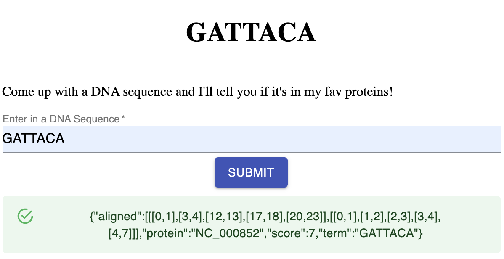

# Ian's Ginkgo Homework

For the sake of time I cloned [this repo](https://github.com/ahmedbesbes/React-App-Flask-SSL). Thanks Ahmed!

## Local Development

Run this

```sh
docker-compose up
```

Then go to `http://localhost:9090/` to bring up the frontend.

Enter a search and if you have a hit you should see this!



## User Story Breakdown

When I first read the requirements I tried to break it down into how I'd schedule or estimate it in a sprint. I've also included my percentage complete in the right-most column.

| Requirements                                                                                                                                                                                                                                                                                                                        | Size | Approach                                                                                                                                                                                                                                                                                                                                                                                                                                                                                                                                                                                                                                                                                                                                                                                                                                                                                                                                                                                                                                                                                                              | Finished |
| ----------------------------------------------------------------------------------------------------------------------------------------------------------------------------------------------------------------------------------------------------------------------------------------------------------------------------------- | ---- | --------------------------------------------------------------------------------------------------------------------------------------------------------------------------------------------------------------------------------------------------------------------------------------------------------------------------------------------------------------------------------------------------------------------------------------------------------------------------------------------------------------------------------------------------------------------------------------------------------------------------------------------------------------------------------------------------------------------------------------------------------------------------------------------------------------------------------------------------------------------------------------------------------------------------------------------------------------------------------------------------------------------------------------------------------------------------------------------------------------------- | -------- |
| A web application serves a simple browser Javascript client that takes a DNA sequence                                                                                                                                                                                                                                               | 1    | A frontend starting with a text field on the page and a submit button                                                                                                                                                                                                                                                                                                                                                                                                                                                                                                                                                                                                                                                                                                                                                                                                                                                                                                                                                                                                                                                 | 100.00%  |
| Upon submission of a DNA sequence, an asynchronous alignment is started to find a Protein that contains the submitted sequence. Note: A service is required for the logic; calling a Python command from an IPC library is not a desired solution.                                                                                  | 2    | Likely a python backend (Django or Flask). First endpoint would be '/search', which is called from the submit button on the frontend. POSTing 'q=GATTACA' as query params to the endpoint, then the endpoint would run an asyncronous Celery task (if there was no cache hit) that calls a Sequence Alignment service. Likely need to use a request-id to keep track of results and fire back to frontend via websockets.                                                                                                                                                                                                                                                                                                                                                                                                                                                                                                                                                                                                                                                                                             | 50.00%   |
| Proteins from the provided list are randomly searched until one is found containing the provided sequence. The list will be much larger in real life.                                                                                                                                                                               | 3    | Load the list of proteins as fasta files via url and the Sequence Alignment Service only searches across that list. It should be a shuffled list and break out of the loop when an alignment is found. When the search finishes, the result would return to the Celery task which would then it would use some good ol' Redis pubsub to publish the results to a subscribed function handling the websocket pushes to the frontend.                                                                                                                                                                                                                                                                                                                                                                                                                                                                                                                                                                                                                                                                                   | 50.00%   |
| The browser client allows for additional submissions before a (the first) submission has completed. When a submission is complete, the web client is updated with the results, which include the name of the protein and where the sequence was found in the protein’s sequence. Simple text-based results is all that is required. | 2    | Below the textfield component, put a table of previous submissions (2 columns, search terms on the left and result on the right), each should have a request-id associated with it under the hood once it has been activated so the websocket transmissions can update the appropriate entry. That could either be done with pure JS manipulating the dom when updates are recieved, or React components that could potentially keep listening as long as their state is pending. Once text is submitted, clear the textfield, append new row to top of submissions table with the search term on the left column and 'pending' in text in the right column. Overwrite the 'pending' with the location result (or null or error messaging) when received.                                                                                                                                                                                                                                                                                                                                                             | 10.00%   |
| A user can close her browser, and upon subsequently revisiting the web application, her previous submissions and any active submissions are reloaded automatically. Note: Users can see their previous searches and respective results.                                                                                             | 3    | Cheapest approach here would be localstorage(formerly known as cookie), but since 'active subissions are reloaded automatically' is a requirement, we'll need some more robust state management. The most expensive approach would be user auth and tables along with saving all their searches, but we could get away with creating a uuid on the client side, saving it to local storage, then using that as an invisible user id to load the home page. Maybe the homepage hits an endpoint called '/homepage' where it passes the uuid as a query param, then that pulls the last 20 searches. Given that we need to keep track of pending/unfinished searches we need to be sure that the backend records that status when saving searches to a SQL db with columns 'user-uuid', 'request-id', 'search-term', 'status', and 'result' with a composite primary key of 'user_uuid' and 'request_id'. I would likely write to Postgres first after a cache miss of the search term when hitting the '/search' endpoint to specify the status as pending, then update the same record at the end of the Celery task. | 0.00%    |
| Running all required processes for local development should be automated; one command.                                                                                                                                                                                                                                              | 1    | use a docker-compose.yml to bring up the frontend, backend, redis, and db together                                                                                                                                                                                                                                                                                                                                                                                                                                                                                                                                                                                                                                                                                                                                                                                                                                                                                                                                                                                                                                    | 100.00%  |
| The URL of the running application.                                                                                                                                                                                                                                                                                                 | 1    | maybe heroku or digital ocean is quicker to setup than AWS if all these services are containerized?                                                                                                                                                                                                                                                                                                                                                                                                                                                                                                                                                                                                                                                                                                                                                                                                                                                                                                                                                                                                                   | 0.00%    |
